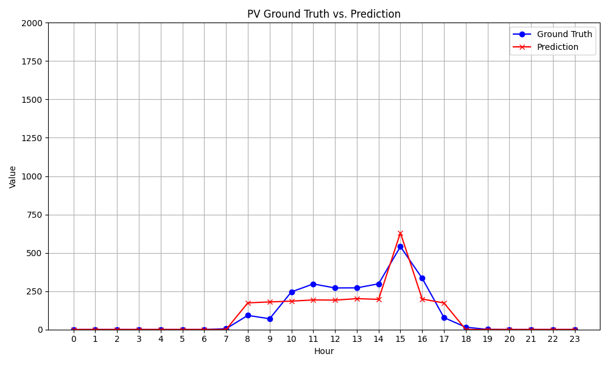
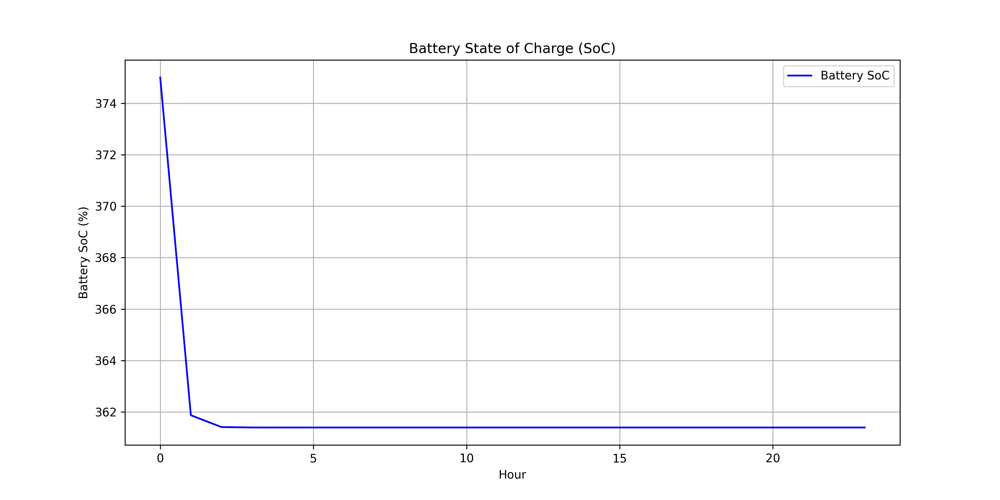

# GIST ict-2023 EMS-Track: Team MYsolar

GIST 창의융합경진대회 2023 EMS-Track, MYsolar 팀 GitHub Repo

## Set-ups

아나콘다(Anaconda) 설치 링크: [Anaconda 공식문서](https://conda.io/projects/conda/en/latest/user-guide/install/download.html)

> conda version: `23.1.0`

`git clone` 으로 파일 다운로드후, 아나콘다 설치 및 가상환경 생성, 패키치 다운로드

```bash
git clone https://github.com/willystumblr/ict-2023-ems.git
conda create -n ENVIRONMENT_NAME python==3.9
pip install -r requirements.txt
```

## Files & Program execution

### Directories and Files

```plaintext
.
├── README.md
├── dataloader.py
├── model.py
├── predict.py     ### FOR EXECUTION ###
├── requirements.txt
├── schedule.py    ### FOR EXECUTION ###
├── load
│   ├── log_optuna.txt
│   ├── main.ipynb
│   ├── pickleviewer.ipynb
│   ├── predict.ipynb
│   ├── best_results
│   │   ├── 20230807_165319.pkl
│   │   └── model_20230807_165319.pt
│   └── data
│       ├── merged_data_KW.xlsx
│       ├── merged_data_MWH.xlsx
│       ├── preprocessing.ipynb
│       ├── test_for_0901.xlsx
│       ├── test_for_0901_withseq.xlsx
│       └── dataset_example
│           └── 2022-08-31.xlsx
└── pv
    ├── \010ict_2023_model_predict.ipynb
    ├── eda.ipynb
    ├── fix.py
    ├── preprocess.py
    ├── checkpoints
    │   ├── LG도서관-checkpoint-2023-08-10 22_10.pt
    │   ├── 대학C동-checkpoint-2023-08-10 22_35.pt
    │   ├── ...
    │   ├── 중앙도서관-checkpoint-2023-08-10 23_26.pt
    │   └── 신재생에너지동-checkpoint-2023-08-10 23_18.pt
    ├── eval_sequence
    │   ├── LG도서관-eval.csv
    │   ├── 대학C동-eval.csv
    │   ├── ...
    │   ├── 삼성환경동-eval.csv
    │   └── 신재생에너지동-eval.csv
    └── results
        ├── LG도서관-2023-08-11-hp.pkl
        ├── 대학C동-2023-08-11-hp.pkl
        ├── ...
        ├── 중앙도서관-2023-08-11-hp.pkl
        └── 신재생에너지동-2023-08-11-hp.pkl
```

### 예측 알고리즘

LSTM 모델을 사용하여, 다음날 24시간의 시간당 발전량/전력사용량 예측을 위해 지난 일주일간의 시간대별 데이터로 학습한다. 손실을 줄이기 위해, 비교적 건물 수가 14개로 적었던 태양광 발전량 데이터는 건물별로 모델을 생성하여 학습하였으며, 건물 수가 많았던(56) 부하 데이터의 경우 컴퓨팅 자원의 한계와 실행시간의 비효율성을 고려하여 건물을 하나의 feature로 설정한다.

- sequence length: 24*7 (지난 일주일의 시간당 데이터)
- label length: 24 (다음날 시간당 예측값)
- hyper-parameters:
  - 태양광 발전량 예측모델:
    ```python
    config ={
    	"num_layers":9,
    	"hidden_size":32,
    	"batch_size":256,
    	"num_epochs":100
    }
    ```
  - 부하 예측 모델
    ```python
    config ={
    	"num_layers": 5,
    	"hidden_size": 128,
    	"batch_size": 128,
    	"num_epochs": 700
    }
    ```

학습 및 검증 후, `.pt` 확장자로 모델의 state를 체크포인트에 저장하였다. 태양광 발전량 및 전력부하량 예측 모델의 학습 및 평가 과정은 각각 pv 폴더와 load 폴더를 확인한다. 각 폴더 내의 readme 혹은 각 코드의 주석을 확인한다면 쉽게 실행할 수 있을 것이다.

저장된 체크포인트와 미리 저장한 검증 데이터셋을 활용, `predict.py`를 실행하여 **2022.08.31**의 시간당 전력사용량 및 태양광 발전량을 예측한다. 환경 세팅이 제대로 되었다면 아래 코드를 실행하여 `pv_predict_for_0831.csv` 파일과 `load_predict_for_0831.csv` 파일을 생성하도록 한다.

```bash
python predict.py --mode pv     ## prediction for PV generation
python predict.py --mode load   ## prediction for load
```

### 스케줄링 알고리즘

파이썬 오픈소스 라이브러리 중,  `pulp`를 활용하여 선형계획법을 구성한다.

이를 정의하기 위하여 사용한 변수 및 함수는 아래와 같다.

1. 의사결정 변수(Decision Variables)

- `energy_bought`: ESS grid로부터 시간당 공급받는(import) 에너지
- `energy_sold`: ESS grid에 시간당 공급하는 에너지
- `energy_charged`: ESS grid에 시간당 충전되는 에너지
- `energy_discharged`: ESS grid에서 시간당 방전되는 에너지
- `battery_level`: 배터리의 상태, 시간대별 시작과 끝을 고려하여 총 25개의 인덱스를 가지도록 변수를 생성함 (0시 0분, 0시 59분 등)

2. 목적 함수(Objective Function)

- 전기요금을 최소화함 (`energy_bought`로 인한 요금 최소화)
- ESS에 저장하는 에너지로부터 이익을 최대화함

3. 제약조건(Constraints)

- 배터리 충전/방전 및 배터리 효율을 고려한 상태(level) 제약
- 에너지 균형

매개변수(Parameter)는 배터리 충·방전 효율, 전기요금, 배터리 최대용량, 그리고 예측모델이 산출한 부하 및 태양광 발전량 예측값 등이 있다.

아래 명령어로 `schedule.py` 파일을 실행한다.

```python
python schedule.py --mode eval
```

## Results

정확한 결과를 위해 다음 두 환경에서 실험하였다.

- conda 가상환경 (Apple M1 core, CPU), python 3.9.17 버전
- Google Colaboratory 환경, V100 GPU 1장, python 3.10.12 버전

CPU 환경에서 `predict.py` 로 태양광 발전량/부하를 예측한 결과는 다음과 같다. 여기서 `Total Prediction Error`의 단위는 kWh이다.

```plaintext
(ict-2023) minsk@Maximus 2023ict % python predict.py --mode load
08/16/2023 00:23:47 - INFO - __main__ -   Predicting LOAD for 0831...
08/16/2023 00:23:47 - INFO - __main__ -   [Unnormalized] MAE: 16.4693, MSE: 1237.4397, RMSE: 35.1773
08/16/2023 00:23:47 - INFO - __main__ -   [Normalized] MAE: 0.0581, MSE: 0.0077, RMSE: 0.0879
08/16/2023 00:23:47 - INFO - __main__ -   Total Prediction Error: 428.0094988500473
08/16/2023 00:23:47 - INFO - __main__ -   Prediction completed. filepath: ./load_predict_for_0831.xlsx

(ict-2023) minsk@Maximus 2023ict % python predict.py --mode pv  
08/16/2023 00:23:56 - INFO - __main__ -   Predicting PV for 0831...
08/16/2023 00:23:56 - INFO - __main__ -   [Unnormalized] MAE: 8.0234, MSE: 143.0949, RMSE: 11.9622
08/16/2023 00:23:56 - INFO - __main__ -   [Normalized] MAE: 0.1551, MSE: 0.0402, RMSE: 0.2004
08/16/2023 00:23:56 - INFO - __main__ -   Total Prediction Error: 279.2447814941406
08/16/2023 00:23:56 - INFO - __main__ -   Prediction completed. filepath: ./pv_predict_for_0831.csv
```

2022년 8월 31일에 대해 평가했으며, 예측값 및 실제값에 대한 자세한 결과는 results 폴더 내의 **load_gt_for_0831_for_submit.csv(부하 실제값), load_predict_for_0831_for_submit.csv(부하 예측값), pv_gt_for_0831_for_submit.csv(태양광 실제값), pv_predict_for_0831_for_submit.csv(태양광 예측값)** 파일에서 확인할 수 있다.

**전력부하량 예측 오차는 MAE: 0.0581, MSE: 0.0077, RMSE: 0.0879 이다.**

**태양광 발전량 예측 오차는 MAE: 0.1551, MSE: 0.0402, RMSE: 0.2004 이다.**

24시간 예측값 및 실제값 그래프는 images 폴더 내의 load_comparison_plot.png(전력부하량 그래프), pv_comparison_plot.png(태양광발전량 그래프)에서 확인할 수 있다.

 

CPU 환경에서 `schedule.py`로 2022년 8월 31일 전기요금을 최적화한 결과는 아래와 같으며, **₩42,719,630**로 계산된다.(명령어는 위 설명 참고)

```plaintext
Welcome to the CBC MILP Solver 
Version: 2.10.3 
Build Date: Dec 15 2019 

command line - /Users/minsk/opt/anaconda3/envs/ict-2023/lib/python3.9/site-packages/pulp/solverdir/cbc/osx/64/cbc /var/folders/5m/_dn3q76s5zb9tr9xkr_8vtnh0000gn/T/75c037db6b034528891e5fee551f8574-pulp.mps timeMode elapsed branch printingOptions all solution /var/folders/5m/_dn3q76s5zb9tr9xkr_8vtnh0000gn/T/75c037db6b034528891e5fee551f8574-pulp.sol (default strategy 1)
At line 2 NAME          MODEL
At line 3 ROWS
At line 126 COLUMNS
At line 509 RHS
At line 631 BOUNDS
At line 657 ENDATA
Problem MODEL has 121 rows, 121 columns and 334 elements
Coin0008I MODEL read with 0 errors
Option for timeMode changed from cpu to elapsed
Presolve determined that the problem was infeasible with tolerance of 1e-08
Analysis indicates model infeasible or unbounded
Perturbing problem by 0.001% of 151.07957 - largest nonzero change 0.00042522749 ( 0.00068925059%) - largest zero change 0.00030592583
0  Obj 0 Primal inf 1198634.1 (50) Dual inf 1248.7934 (24)
0  Obj 0 Primal inf 1198634.1 (50) Dual inf 5.9075233e+11 (50)
63  Obj 21276139 Primal inf 956996.26 (33) Dual inf 2.3680067e+11 (41)
94  Obj 42685794 Primal inf 802600.7 (24) Dual inf 4.3245042e+09 (1)
95  Obj 42719630 Primal inf 802432.65 (24)
Primal infeasible - objective value 42719630
PrimalInfeasible objective 42719629.54 - 95 iterations time 0.002

Result - Linear relaxation infeasible

Enumerated nodes:           0
Total iterations:           0
Time (CPU seconds):         0.00
Time (Wallclock Seconds):   0.02

Option for printingOptions changed from normal to all
Total time (CPU seconds):       0.00   (Wallclock seconds):       0.02

Status: Infeasible
Optimized Cost: ₩42,719,630
```

이에 해당하는 이미지는 images 폴더 내의 scheduling_energy_plot.png, scheduling_soc_plot.png이다. PV 발전량이 Load에 비해 매우 작아, PV Generation과 Energy Sold는 거의 0에 가깝게 나타났다.

 
